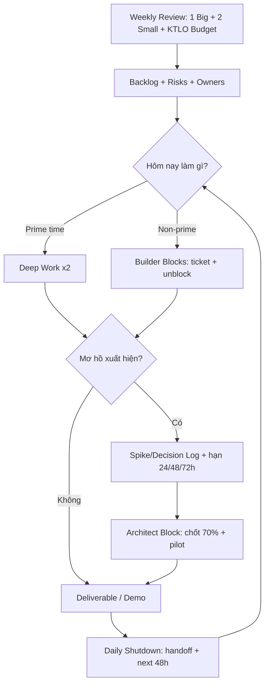

# Operating System Cá Nhân – Thắng Nguyễn (v1.1)

> Mục tiêu: **tốc độ bền vững** = *quyết sớm – chạy nhanh – không đốt pin – không làm SPOF (single point of failure).*  
> Bản v1.1 là “bản vá” sau khi bạn phản hồi về: việc phức tạp kéo dài/khó đo, Zephyr là KTLO, và gánh nặng techlead thiết kế hệ thống.

---

## Table of Contents

- [0) Bản đồ vấn đề (đúng cái bạn đang gặp)](#0-bản-đồ-vấn-đề-đúng-cái-bạn-đang-gặp)
- [1) 5 Luật vận hành (đã đóng gói thành cơ chế)](#1-5-luật-vận-hành-đã-đóng-gói-thành-cơ-chế)
- [2) 4 “sọột” để tránh lẫn lộn (quản lý hiệu suất vs thiết kế vs ý tưởng)](#2-4-sọột-để-tránh-lẫn-lộn-quản-lý-hiệu-suất-vs-thiết-kế-vs-ý-tưởng)
- [3) Cadence review: ngày/tuần/tháng/quý (nhẹ nhưng đủ lực)](#3-cadence-review-ngàytuầnthángquý-nhẹ-nhưng-đủ-lực)
- [4) Lịch block mẫu (chạy sáng + tập tối + ngủ 23:00–05:00)](#4-lịch-block-mẫu-chạy-sáng--tập-tối--ngủ-230005000)
- [5) Sơ đồ vận hành (tổng quan)](#5-sơ-đồ-vận-hành-tổng-quan)
- [6) Checklist áp dụng ngay (trong 48 giờ)](#6-checklist-áp-dụng-ngay-trong-48-giờ)
- [7) Template (copy/paste)](#7-template-copypaste)
- [8) Kết luận](#8-kết-luận-gia-cát-lượng-làm-trục--lưu-bang-làm-phong-cách-đúng-và-đã-thành-cơ-chế)
- [9) Task Standard v1](#9-task-standard-v1)
- [10) Backlog Structure v1](#10-backlog-structure-v1)
- [11) Priority Score v1](#11-priority-score-v1)
- [12) Scheduler Engine v1](#12-scheduler-engine-v1)
- [13) Knowledge Engine v1](#13-knowledge-engine-v1)
- [14) Anti-Gravity Rules v1](#14-anti-gravity-rules-v1)
- [Kiến trúc Personal OS v1 — Tổng quan](#kiến-trúc-personal-os-v1--tổng-quan)

---

## 0) Bản đồ vấn đề (đúng cái bạn đang gặp)

### Năng lực lõi
- Nhìn cục diện + đặt vấn đề + giao tiếp ⇒ tạo **khung** để người khác hiểu và chạy.
- Thiết kế hệ thống + lập kế hoạch dự án mạnh ⇒ thấy “đường đi nước bước”.
- Ước lượng nguồn lực / rủi ro tốt ⇒ ít ảo tưởng.
- Dùng người ổn ⇒ có nền để phân quyền.

### Cái giá phải trả
- Tham vọng + cơ hội ⇒ scope phình, kỳ vọng phình.
- Ôm đồm vì hệ thống phụ thuộc bạn ⇒ **SPOF**.
- Overthinking tầng mơ hồ ⇒ nghẽn quyết định ⇒ nghẽn thực thi.
- Chảy máu năng lượng vì phân tâm + nhiều role ⇒ bào mòn tinh thần.
- Motivation dao động ⇒ chạy tốt khi có cơ chế nhưng mới ~50–60%.

**Kết luận:** bạn thiếu không phải là năng lực, mà là **cơ chế chuyển hoá năng lực thành tốc độ bền vững**.

---

## 1) 5 Luật vận hành (đã đóng gói thành cơ chế)

### Luật 1 — Cadence cho việc mơ hồ (không chỉ “quyết định”)
Vấn đề quan trọng thường là **task phức tạp kéo dài, không đo được**.  
Giải pháp: chia thành 3 pha có **timebox** để không rơi vào “mơ hồ → trì hoãn”.

#### Pha A — Spike (Làm rõ)
- Timebox: **60–120 phút**
- Output bắt buộc (1 trang):
  - Bối cảnh / mục tiêu / ràng buộc
  - 2–3 hướng (options)
  - Rủi ro lớn
  - **Next 48h** (cần ai/dữ liệu/thử gì)

#### Pha B — Plan (Đủ để chạy)
- Timebox: **60–90 phút**
- Output:
  - WBS 5–10 dòng
  - milestone chính
  - DoD thô (DoD-0/1)
  - owner sơ bộ

#### Pha C — Execute (Đẩy vòng lặp)
- Thực thi theo ticket/owner
- Bạn giữ: tiêu chuẩn + bottleneck + quyết định

> Nguyên tắc: **Hết timebox → chốt 70% + pilot**, không để mở vô hạn.

---

### Luật 2 — Scope Budget + KTLO (Zephyr là “Keep The Lights On”)
Một số việc (như Zephyr giờ hành chính) không phải Big Bet nhưng ăn nhiều thời gian ⇒ đó là **KTLO / Run-the-business**.

#### 2.1 One Big Bet + Two Small Bets (mỗi tuần)
- **1 Big Bet**: thứ làm đổi vị thế (outcome lớn)
- **2 Small Bets**: hỗ trợ/tăng tốc/học nhanh
- Mọi thứ khác: backlog hoặc ủy quyền

#### 2.2 Thêm bucket KTLO + Capacity Budget
KTLO **không cạnh tranh bằng mục tiêu**, mà cạnh tranh bằng **capacity**.  
→ Phải định ngân sách thời gian cố định:

Ví dụ (điều chỉnh theo thực tế):
- **60–70%**: Zephyr KTLO
- **20–30%**: Big Bet công việc chính (release/quality/milestone)
- **10%**: buffer/sự cố

**Hai điều kiện bắt buộc để KTLO không “ăn sạch não”:**
1) **Module Owners** (build/CI, feature, bugs/release…)
2) **Techlead Office Hours**: 2 khung cố định/ngày để unblock/ra quyết định  
   (ngoài khung đó: mọi thứ vào ticket/decision log)

---

### Luật 3 — 2 Mode/Day: Architect vs Builder (tách não)
Không trộn “tầng cao” và “tầng thấp” trong cùng thời điểm.

**Architect (60–90’):**  
- khung/rủi ro/ưu tiên/quyết định  
- output: 1–2 quyết định + kế hoạch đủ chạy

**Builder (2–4 block):**  
- đẩy ticket, unblock, demo, đóng vòng lặp  
- output: deliverable cụ thể

**Rule:** đang Builder mà thấy mơ hồ → ném vào Decision/Spike log → xử trong Architect block.

---

### Luật 4 — Anti-SPOF: bạn chỉ giữ 2 thứ (và DoD phải “tiến hoá”)
Bạn là techlead ⇒ phải thiết kế hệ thống, nhưng không được “đốt não” và trở thành SPOF.

#### 4.1 Bạn chỉ giữ
1) **Tiêu chuẩn / Definition of Done**  
2) **Bottleneck + rủi ro + ưu tiên + nguồn lực**

Còn lại giao cho owner/module owner.

#### 4.2 DoD 3 mức (để bạn không kiệt sức)
- **DoD-0 (15’ khi khởi động)**: mục tiêu, non-goals, boundary/interface, 1–2 test tối thiểu
- **DoD-1 (30–45’ sau Spike)**: happy path, top 3 risks + cách test, metrics/logs cần có
- **DoD-2 (trước release)**: edge cases, perf/robustness, CI checks

> DoD không cần hoàn hảo ngay từ đầu. DoD là thứ **tiến hoá**.

#### 4.3 Thiết kế thành “tài sản tái dùng”
- **RFC (1–2 trang)**: đề xuất kiến trúc (problem/constraints/acceptance/options)
- **ADR (5–10 dòng)**: ghi lại quyết định (decision + rationale)

#### 4.4 Delegation cho thiết kế (không gánh 100%)
- Bạn viết RFC khung + acceptance criteria
- Giao 2 người viết option A/B trong 48h
- Bạn chọn 70% + pilot

---

### Luật 5 — Energy Budget (năng lượng là tài sản, không phải cảm hứng)
Motivation dao động là bình thường. Cần **cơ chế bảo toàn pin**.

- Mỗi ngày chỉ có **2 block “Deep/High”**
- Phân tâm/ham muốn: **cho quota 20–30 phút/ngày** (đừng cố “triệt” bằng ý chí)
- Ngủ/nhịp/ăn/uống/phục hồi là **hạ tầng**, không đem ra trả nợ công việc.

---

## 2) 4 “sọt” để tránh lẫn lộn (quản lý hiệu suất vs thiết kế vs ý tưởng)
Bạn hay lẫn lộn giữa: quản lý hiệu suất, kỷ luật, thiết kế hệ thống, lên ý tưởng.

Tách thành 4 buckets:
1) **Execution** – tạo output  
2) **Management** – tiến độ/người/risk  
3) **System Design** – kiến trúc/cơ chế  
4) **Ideas** – ý tưởng lung tung  

**Cơ chế thực thi:**
- Mỗi ngày **1 Inbox duy nhất** (chỗ đổ mọi thứ vào)
- Mỗi ngày **1 lần xử Inbox** (ví dụ 21:30–22:00)
- Ý tưởng nảy ra trong lúc làm → ghi 1 dòng vào **Idea Parking Lot** (≤10s) → quay lại.

---

## 3) Cadence review: ngày/tuần/tháng/quý (nhẹ nhưng đủ lực)

### Daily Startup (10’)
- Deep #1 / Deep #2 hôm nay là gì?
- Việc nào tới hạn Spike/Decision?
- Hôm nay mình giữ gì (DoD + bottleneck), giao gì?

### Daily Shutdown (10’)
- Done/Not done (1 dòng)
- Unblock request cho owner
- Hẹn Architect block cho việc mơ hồ ngày mai

### Weekly Review (60’)
1) Chọn **1 Big + 2 Small**
2) Top 3 risks
3) DoD cho Big Bet (đo được)
4) Chia deliverable + gắn owner (anti-SPOF)
5) Decision list (các quyết định cần chốt)

### Monthly Review (45–60’, cực nhẹ)
- 3 wins / 3 lessons / 3 bottlenecks
- cập nhật Capacity Budget (KTLO chiếm bao nhiêu %)
- 1 theme tháng (ví dụ “Anti-SPOF”)

### Quarterly Review (90’, chỉ 3 việc)
1) Stop doing list (cắt)
2) Delegation ladder (đẩy ownership)
3) 1 big outcome quý (đo được)

> Lưu ý: đừng biến tháng/quý thành “dự án tối ưu năng suất”, sẽ quay lại overthinking.

---

## 4) Lịch block mẫu (chạy sáng + tập tối + ngủ 23:00–05:00)
Mẫu ngày thường (tùy lịch công ty):

- **05:00–06:00**: chạy/HIIT nhẹ + tắm
- **06:00–06:30**: ăn sáng (không điện thoại)
- **06:30–07:15**: **Architect block (45–60’)**: spike/decision/risk/priority
- **08:30–10:00**: **Deep Work #1** (Job 1)
- **10:15–11:30**: Builder (tickets/review/sync)
- **13:30–15:00**: **Deep Work #2** (Job 1)
- **15:15–17:00**: Builder + handoff (anti-SPOF)
- **18:30–19:30**: tập sức mạnh + nấu ăn
- **20:00–21:30**: Job 2 (Small Bet) hoặc UT practice (luân phiên)
- **21:30–22:00**: shutdown + xử Inbox + plan ngày mai
- **23:00**: ngủ

**Quy tắc vàng:** Deep #1/#2 là “đất thiêng” — không họp, không chat, không cứu hoả (trừ SEV thật).

---

## 5) Sơ đồ vận hành (tổng quan)



---

## 6) Checklist áp dụng ngay (trong 48 giờ)

### Trong 24 giờ
- Tạo 1 Inbox (Notion/TickTick đều được)
- Tạo 4 nhãn: Execution / Management / System / Ideas
- Tạo Idea Parking Lot
- Đặt 2 khung **Techlead Office Hours** cố định

### Trong 48 giờ
- Chốt Capacity Budget tuần cho Zephyr (KTLO %)
- Chỉ định tối thiểu 2–3 Module Owners
- Chuẩn hoá DoD-0 template
- Tạo RFC/ADR template (rất ngắn cũng được)

---

## 7) Template (copy/paste)

### 7.1 Spike (1 trang)
- Context:
- Goal:
- Constraints:
- Options (A/B/C):
- Top risks:
- Decision deadline:
- Next 48h (who/what):

### 7.2 DoD-0 (15’)
- Goal:
- Non-goals:
- Boundary/Interface:
- Minimum tests (1–2):
- Owner:

### 7.3 ADR (5–10 dòng)
- Decision:
- Date:
- Status:
- Context:
- Rationale:
- Consequences:

---

## 8) Kết luận: “Gia Cát Lượng làm trục – Lưu Bang làm phong cách” (đúng và đã thành cơ chế)
- **Gia Cát Lượng (Kim):** chuẩn hóa, cadence, phân quyền, checklist, đo lường  
- **Lưu Bang (Thủy):** non-attachment, quyết sớm, buông đúng lúc, giữ lực đường dài

Bản OS này biến hai thứ đó thành **hệ vận hành cụ thể** để bạn nâng từ 50–60% lên trạng thái **tự duy trì** mà không đốt tinh thần.
---

## 9) Task Standard v1

> Schema tối thiểu để mọi task/phase có thể đi vào lịch và ra được artifact.

### 9.1 Fields bắt buộc

| Field | Mô tả |
|---|---|
| **Goal** | Mục tiêu 1 câu — rõ đủ để biết khi nào xong |
| **Type** | Loại task (xem 9.2) |
| **Size** | XS / S / M / L / XL (xem định nghĩa bên dưới) |
| **Ambiguity** | 0–5 (0 = hoàn toàn rõ, 5 = rất mơ hồ) |
| **Expected Artifact** | Output cụ thể kỳ vọng (file / commit / doc / decision) |
| **DoD** | Điều kiện dừng — đọc lại biết mình đã xong chưa |
| **Status** | Inbox / Backlog / Next / Scheduled / Done / Killed |
| **Owner** | Ai chịu trách nhiệm (mặc định là bản thân) |

### 9.2 Task Types

| Type | Mục đích |
|---|---|
| **Execution** | Thực thi rõ ràng — có output/artifact cụ thể |
| **Spike / Framing** | Làm rõ mơ hồ — output là hiểu biết / quyết định / scope |
| **KTLO / Maintenance** | Duy trì hệ thống — không tạo value mới nhưng không làm sẽ đứt |
| **System Change** | Thay đổi cách vận hành — quyết định ở Weekly/Monthly Review |

### 9.3 Size

| Size | Ý nghĩa |
|---|---|
| **XS** | ≤30 phút |
| **S** | ~1–2h |
| **M** | ~2–4h (nửa ngày) |
| **L** | ~1 ngày — chỉ schedule khi đã rõ |
| **XL** | >1 ngày — **phải tách phase trước khi schedule** |

### 9.4 Readiness Rule
Task chỉ được đi vào scheduling khi:
- Goal rõ ràng (biết xong nghĩa là gì)
- Size ước lượng được
- Ambiguity đã estimate
- Expected Artifact xác định
- DoD đủ nhìn thấy để dừng an toàn

### 9.5 Hard Rules
- **XL không được schedule trực tiếp** — tách thành phases (M/L) trước
- **Ambiguity ≥ 4 không được execute trực tiếp** — convert thành Spike/Framing trước
- Không có task nào không có artifact kỳ vọng
- Scheduler vận hành trên task/phase, không nhận "goal mờ"

### 9.6 Task Card (example)
```
- Goal: Viết spec pub/sub interface cho RobotOS Middleware
- Type: Execution
- Size: M
- Ambiguity: 2
- Expected Artifact: spec/pubsub_interface_v1.md
- DoD: Đọc lại 10' sau — hiểu được API surface và constraints
- Status: Scheduled
```

---

## 10) Backlog Structure v1

> Mọi việc phải đi đúng tầng. Không kéo Inbox thẳng vào lịch.

### 10.1 Flow

```
Inbox / Raw Ideas
      ↓
   Backlog
      ↓
    Next
      ↓
 This Month
      ↓
  This Week
      ↓
    Today
```

### 10.2 Định nghĩa từng tầng

| Tầng | Mục đích | Thuộc về đây | KHÔNG thuộc về đây |
|---|---|---|---|
| **Inbox / Raw Ideas** | Chứa ý tưởng thô chưa đánh giá | Mọi thứ nảy ra trong ngày | Task có scope rõ |
| **Backlog** | Danh sách "có thể làm" — chưa cam kết | Item đã mô tả ngắn, chưa chắc được chọn | Việc đang làm, việc urgent |
| **Next** | Đủ rõ, đủ gần để xem xét tháng/tuần tới | Item đã qua tối thiểu Ambiguity check | Item chưa có Goal/Artifact |
| **This Month** | Outcome/priority được chấp nhận ở cấp tháng | Item đã qua scope/capacity check tháng | Backlog chưa được chọn |
| **This Week** | Commitment đã chọn từ monthly scope + backlog selection | Item Pick từ section 5.6 Weekly template | Item "tự mở rộng" ngoài selection |
| **Today** | Task/phase được schedule để thực thi hôm nay | Item từ This Week, đủ readiness | XL task, Ambiguity ≥ 4 chưa qua Spike |

### 10.3 Promotion Rules
- **Inbox → Backlog:** có Goal tối thiểu + đủ để viết 1 dòng rõ ràng
- **Backlog → Next:** Ambiguity ≤ 3, có Expected Artifact, có thể estimate Size
- **Next → This Month / This Week:** đã qua scope check + capacity check
- **Next → Spike:** Ambiguity ≥ 4 — phải làm rõ trước
- **Stale quá lâu:** archive / kill / reframe (không để backlog bốc mùi)

### 10.4 Review Cadence
- **Inbox:** clear nhanh — cùng ngày hoặc trong 24h
- **Backlog:** review định kỳ (không nhất thiết hàng tuần)
- **Next:** review trước mỗi vòng weekly/monthly planning

---

## 11) Priority Score v1

> Công cụ hỗ trợ chọn việc. Không thay thế trade-off hay capacity judgment.

### 11.1 Model

Score 4 yếu tố, mỗi yếu tố 1–3:

| Yếu tố | 1 | 2 | 3 |
|---|---|---|---|
| **Strategic Alignment** | Ít liên quan North Star / outcome tháng / mục tiêu quý | Có liên quan | Trực tiếp thúc đẩy |
| **Impact** | Ít giá trị nếu xong | Có giá trị rõ | Tạo ra sự thay đổi đáng kể |
| **Urgency** | Không cần làm sớm | Có deadline hoặc blocker | Càng chậm càng mất giá trị |
| **Effort Cost** | Nhanh / nhẹ | Vừa | Nặng / tốn nhiều capacity |

**Công thức:**
```
Priority Score = Strategic Alignment + Impact + Urgency - Effort Cost
```

Range: **0 → 9**

### 11.2 Interpretation

| Score | Ý nghĩa |
|---|---|
| 7–9 | Ưu tiên chọn trước |
| 4–6 | Chọn nếu capacity cho phép |
| 0–3 | Backlog / defer / kill |

### 11.3 Rules
- Score là công cụ hỗ trợ, **không phải chân lý tuyệt đối**
- Quyết định trade-off vẫn thắng raw score
- Ambiguity cao có thể làm giảm readiness dù score cao
- KTLO có thể bypass score khi thực sự bắt buộc
- Không tốn quá 2 phút để score một item
- **Unblock override (judgment-required):** Nếu một blocker đang chặn 2+ tasks hoặc một critical handoff downstream, việc unblock nó có thể có giá trị tổng thể cao hơn raw score của nó — ưu tiên remove blocker thay vì optimize local item. Áp dụng với judgment; không tự động hóa.

---

## 12) Scheduler Engine v1

> Spec vận hành lịch từ Week xuống Day. Scheduler là execution selection, không phải scope expansion.

### 12.1 Đơn vị scheduling
- Scheduler vận hành trên **task/phase**, không nhận project mờ
- Đơn vị ưu tiên: **M** (2–4h, nửa ngày)
- **S**: support / prep / wrap-up
- **L**: chỉ dùng khi đã đủ rõ
- **XL**: bắt buộc tách phase trước

### 12.2 Daily capacity model
Một ngày bình thường:
- **2–3 M tasks** (hoặc 1 L + 1–2 S)
- **1–2 S tasks** support/wrap-up
- **Max 1 item ambiguity cao** mỗi ngày
- Luôn giữ buffer — không pack kín ngày

### 12.3 Ordering rules (gợi ý thứ tự trong ngày)
1. Fixed events (meeting, sync bắt buộc)
2. Review / prep (Architect block ~30')
3. **High-value / High-ambiguity work** — khi năng lượng còn cao
4. Lower-ambiguity execution (Builder blocks)
5. Wrap-up / close / handoff

### 12.4 Protection rules
- Không xếp nhiều item ambiguity cao liền nhau trong cùng 1 ngày
- Nếu task vỡ trong lúc execute → reschedule phần còn lại như 1 phase mới
- Nếu item urgent mới xuất hiện trong ngày/tuần → **swap**, không cộng dồn
- Buffer là bắt buộc, không phải tùy chọn

### 12.5 Fallback / Khi ngày vỡ kế hoạch
1. Không rewrite lại toàn bộ ngày
2. Giữ **1 item giá trị cao nhất** còn lại
3. Push phần còn lại về This Week / Next
4. Kết ngày với:
   - Artifact đã hoàn thành hôm nay
   - Item còn dở → tiếp tục ngày mai
   - First step ngày mai

### 12.6 Weekly-to-Daily bridge
- Daily plan phải đến từ **weekly commitments**
- Không tạo commitment lớn mới ở cấp ngày
- Daily scheduling = **chọn item để execute**, không phải expand thêm scope
- Nếu something mới khẩn cấp → apply swap rule (Midweek Commitment Swap)

### 12.7 Anchor Scheduler Rule (v1)

> Anchor = daily directional focus. Not a task list. Not a checklist. One day, one direction per project slot.

**Daily anchor limit: 2**
- **Primary Anchor** — dominant direction for the day (highest capacity goes here)
- **Secondary Anchor** — supporting direction (≤ 30–40% of remaining capacity)
- *(Optional)* Review / Recovery / Buffer marker — use on heavy meeting days or end-of-week

**Rules:**
1. A normal day MUST NOT have 3 concurrent project anchors.
2. Anchor is outcome-oriented, not micro-task-oriented. One directional sentence per anchor.
3. Weekday operating rhythm:
   - **Mon–Fri:** Zephyr is dominant (office-hours project). Zephyr = Primary Anchor most days.
   - Secondary rotates between Signee and RobotOS based on week mission priority.
4. Weekend operating rhythm:
   - Signee / RobotOS = Primary focus.
   - Must include time for Weekly Review / cadence reset (Sunday preferred).
5. If a day is all Zephyr (heavy meetings or incident), Secondary Anchor may be omitted — write *(none / buffer)* explicitly.
6. Anchor generation: Week Mission → Execution Anchors → Daily Morning Setup → block selection.
   Do NOT copy missions mechanically. Compress to a direction.

---

### 12.8 Execution Rule — Work Time Domain

> **Canonical rule.** Referenced by daily template and weekly planning.

**Office hours (Mon–Fri, 8:00–17:30):** Zephyr work only.  
**Evening (17:30+) and weekends:** RobotOS / Signee / personal projects only.

- Protects primary responsibility from fragmentation.
- Personal projects have flexible timing; Zephyr has team sync windows.
- Exception: personal project may enter office hours only with explicit justification in Morning Setup (e.g., hard external deadline, blocking dependency).

---

### 12.9 Execution Rule — Evening Capacity Guard

> **Canonical rule.** Weekday evenings are a constrained execution domain. Planning must reflect real recovery needs after office work.

**Scope:** Mon–Fri evenings by default. Weekend evenings are more flexible and not subject to this rule unless explicitly flagged.

**Default allowed load (weekday evening):**
- Max 1 primary evening block
- Optional 1 light support/admin block
- Do NOT schedule 2 heavy (M/L) project blocks by default
- No L-sized tasks in weekday evening blocks

**Allowed evening planning patterns:**
- `1 × M` (one meaningful block)
- `2 × S` (two light blocks)
- `1 × S` if energy is degraded

**Downgrade triggers — switch to S-only mode if any of these are present:**
- Low sleep / poor recovery
- Heavy office fatigue (intense meetings, incident, deep problem-solving day)
- Heavy workout day
- Late meal / post-dinner energy drop
- Dinner and rest mixed into a single unstructured block (≥1.5h, no clear transition): known painkiller pattern — reduces short-term stress but does not restore capacity; evening session quality will likely be degraded
- Unusually high ambiguity task planned for the evening
- Emotional friction or overload signals

**Downgrade behavior:**
- Switch evening mode to S-only
- Keep only the most strategic evening task
- Move the rest to backlog, weekend, or next suitable slot
- Do not force catch-up inside the same evening

**Intent:** Protect system trustworthiness. Avoid hidden overcommitment. Keep RobotOS / Signee progressing steadily at realistic pace rather than collapsing into repeated spillover.

---

### 12.10 Execution Rule — Re-entry Guard

> **Canonical rule.** Any meaningful unfinished block must leave a Re-entry Package before day closure. Prevents vague carry-over and ensures multi-session work stays recoverable with low restart friction.

**Scope:**
- Applies whenever a meaningful block is not completed as planned
- Applies to both office-hours and evening work
- Applies especially to blocks that produce or modify artifacts

**Core rule:** Any unfinished meaningful block must leave a Re-entry Package before day closure.

**Re-entry Package — required fields:**

| Field | Description |
|---|---|
| **Current phase** | Where the work stopped within the block / artifact flow |
| **Artifact state** | Current state of the output (not started / draft exists / partially verified / blocked / waiting response / ready for review) |
| **Next exact step** | A concrete 10–15 minute restart action; specific enough to start immediately without re-analysis |
| **Re-entry condition** | What kind of slot or condition is required to resume (e.g., needs office-hours Zephyr block / needs evening primary block / needs dependency resolved first / needs high-energy session) |

**Invalid closure examples (not acceptable):**
- Continue tomorrow
- Finish later
- Resume RobotOS
- Keep going next time
- Complete remaining work tomorrow

**Valid Re-entry Package examples:**

*Example 1 (Zephyr office-hours):*
- Current phase: smoke tests done; blocker summary not yet written
- Artifact state: test log complete; summary missing
- Next exact step: write 5-line blocker summary from build notes into report
- Re-entry condition: next office-hours Zephyr block

*Example 2 (RobotOS evening primary block):*
- Current phase: scope draft reviewed; open questions not extracted
- Artifact state: draft exists; unknowns list missing
- Next exact step: extract 3 unresolved questions from spike notes
- Re-entry condition: evening primary block (not support slot)

*Example 3 (blocked — dependency):*
- Current phase: Signee verification started; blocked by missing device response
- Artifact state: checklist partially filled; blocked
- Next exact step: rerun verification after dependency response arrives
- Re-entry condition: dependency resolved first; next suitable low-ambiguity slot

**Intent:**
- Reduce restart friction
- Make carry-over recoverable across sessions
- Protect continuity for multi-session work
- Prevent stale unfinished tasks from accumulating and eroding system trust

---

### 12.11 Task Intake & Admission

> **Canonical specification:** `01_OS/TASK_INTAKE_AND_ADMISSION.md`

This subsystem sits between backlog/mission intent and weekly/daily scheduling. It standardizes task analysis before execution commitment.

**Conceptual flow:**
```
Raw task idea
→ Task Intake (Level 1 — Quick Intake)
→ Task Analysis Card (Level 2 — for M+ / ambiguous / strategic / multi-session)
→ Admission Decision (Level 3 — go / split / spike / clarify / backlog)
→ Weekly / Daily scheduling
→ Execution
→ Re-entry / Signals / Review
```

**Three levels:**
- Level 1 — Quick Intake: lightweight classification for all non-trivial tasks
- Level 2 — Task Analysis Card: deeper analysis for M+ / ambiguous / strategic tasks
- Level 3 — Admission Decision: go / split / spike / clarify / backlog

**Hard minimum:** Any task with ambiguity ≥ 4, size XL, or unclear artifact must resolve pre-steps before entering execution scheduling.

See `01_OS/TASK_INTAKE_AND_ADMISSION.md` for full specification, project defaults, examples, and agent behavior rules.

---

### 12.12 Knowledge Extraction Engine

> **Canonical specification:** `01_OS/KNOWLEDGE_EXTRACTION_ENGINE.md`

The Knowledge Extraction Engine is the learning layer that converts repeated execution patterns into reusable heuristics for future intake/admission quality.

**Position in architecture:**
```
Execution → Signals / Artifacts
→ Weekly Intelligence / Monthly Reflection
→ Knowledge Extraction Engine
→ Better future Task Intake / Admission proposals
```

**Outputs:**
- Project heuristics memory (Zephyr / RobotOS / Signee)
- Estimation corrections
- Artifact mapping corrections
- Capacity fit rules
- Re-entry risk patterns
- Admission failure patterns

**Extraction frequency:**
- Light extraction: weekly (during Weekly Intelligence)
- Consolidation: monthly (during Monthly Reflection)
- No daily extraction overhead

**Relation to Task Intake & Admission:**
- §12.11 (Task Intake & Admission) defines the decision protocol
- §12.12 (Knowledge Extraction Engine) improves future proposal quality
- Hard OS rules always override learned heuristics

See `01_OS/KNOWLEDGE_EXTRACTION_ENGINE.md` for full specification, output categories, and update rules.

---

### 12.13 Project Phase Batching Rule

> **Planning rule.** Based on observed execution pattern: allocating only 1–2 days to a personal project phase is typically too short for meaningful completion. A minimum batching window of 3–4 consecutive or near-consecutive day-equivalents is required to push a phase to handoff-ready state.

**Rule:**
- A meaningful project phase (demo prep, architecture spike, integration, feature completion) should receive **at least 3–4 day-equivalents of focused time** before being paused or handed off.
- Allocating 1–2 days is acceptable only for S/XS tasks or continuation anchors — not for phase-level completion.
- When planning a week with two active Pool B projects, do not split the week evenly by default. Prefer concentrating 3–4 day-equivalents on the higher-priority project, then 1–2 day-equivalents on support or admin tasks for the other.

**Intent:** Reduces context-switching overhead. Enables a phase to reach a collaborator-handoff-ready state before switching. Prevents the repeated "1–2 day incomplete push" pattern where neither project advances meaningfully.

> Note: This rule applies primarily to Pool B (weekend/personal project scheduling). It does not affect Zephyr KTLO weekday dominance.

---

## 13) Knowledge Engine v1

> Knowledge Engine chịu trách nhiệm cho nghiên cứu, học tập kỹ thuật, lưu trữ quyết định kiến trúc, nén kiến thức quan trọng, và hỗ trợ thiết kế hệ thống.

Knowledge Engine **không phải** hệ ghi chú tự do.

Mọi knowledge item phải tạo ra **knowledge artifact** cụ thể.

---

### 13.1 Knowledge Artifact Types

#### Research Note
**Dùng khi:** đọc tài liệu, khảo sát framework, so sánh giải pháp.

**Output:** `RESEARCH_NOTE`

| Field | Nội dung |
|---|---|
| **Question** | Câu hỏi khởi đầu research |
| **Sources** | Tài liệu / link tham khảo |
| **Key findings** | Những gì đã học được |
| **Insight** | Hiểu biết mới quan trọng |
| **Possible directions** | Hướng tiếp theo |

---

#### ADR (Architecture Decision Record)
**Dùng khi** có quyết định thiết kế quan trọng cần lưu lại lý do.

**Output:** `ADR`

| Field | Nội dung |
|---|---|
| **Context** | Bối cảnh khi đưa ra quyết định |
| **Problem** | Vấn đề cần giải quyết |
| **Options considered** | Các lựa chọn đã xem xét |
| **Decision** | Quyết định được chọn |
| **Consequences** | Hệ quả / trade-off |

Ví dụ: `ADR-001_adapter_boundary.md`, `ADR-002_priority_model.md`

---

#### Knowledge Summary
**Dùng khi** đã hiểu một chủ đề và cần nén kiến thức để reuse sau.

**Output:** `KNOWLEDGE_SUMMARY`

| Field | Nội dung |
|---|---|
| **Topic** | Chủ đề |
| **Core model** | Model / mental model cốt lõi |
| **Key rules** | Quy tắc quan trọng cần nhớ |
| **Pitfalls** | Lỗi phổ biến cần tránh |
| **Reusable patterns** | Pattern có thể áp dụng lại |

**Mục đích:** giúp reuse kiến thức nhanh mà không phải đọc lại toàn bộ.

---

#### Design Document
**Dùng khi** thiết kế hệ thống hoặc component phức tạp.

**Output:** `DESIGN_DOC`

| Field | Nội dung |
|---|---|
| **Problem** | Bài toán cần giải |
| **Requirements** | Yêu cầu / constraints |
| **Architecture** | Kiến trúc tổng thể |
| **Key components** | Các thành phần chính |
| **Trade-offs** | Đánh đổi đã chấp nhận |

Ví dụ: `robotos_architecture.md`

---

### 13.2 Knowledge Flow

```
Question
    ↓
Research
    ↓
Research Notes
    ↓
Insight
    ↓
Decision
    ↓
ADR
    ↓
Design Document
```

**Research → Decision → Design.**

Flow này đảm bảo knowledge trở thành system understanding, không phải ghi chú rời rạc.

---

### 13.3 Knowledge Tasks

Một số task trong Task Engine tạo ra knowledge artifact.

| Task Type | Expected Artifact |
|---|---|
| Spike / Research | `RESEARCH_NOTE` hoặc `KNOWLEDGE_SUMMARY` |
| Architecture Design | `ADR` hoặc `DESIGN_DOC` |
| System Analysis | `RESEARCH_NOTE` → `ADR` |

**Rule:** Ambiguity ≥ 4 → không execute thẳng → convert thành Spike/Research task trước.

Mọi learning task phải có artifact output — không tạo "tôi đã học" mà không có gì để lại.

---

### 13.4 Knowledge Repository Structure

```
knowledge/
├── research/          ← Research Notes
├── adr/               ← Architecture Decision Records
├── summaries/         ← Knowledge Summaries
└── design/            ← Design Documents
```

Ví dụ:

```
knowledge/research/
    zephyr_thread_model.md
    rtos_priority_scheduling.md

knowledge/adr/
    ADR-001_adapter_boundary.md
    ADR-002_priority_model.md

knowledge/summaries/
    rtos_scheduling_patterns.md

knowledge/design/
    robotos_architecture.md
```

---

### 13.5 Knowledge Governance

- Không tạo ghi chú dài mà không có artifact rõ ràng
- Research phải kết thúc bằng **insight** hoặc **decision** — không để research "trôi"
- ADR dùng cho quyết định kiến trúc quan trọng (không phải mọi quyết định nhỏ)
- Knowledge Summary dùng để nén kiến thức reusable (không phải tóm tắt thô)
- Design Document dùng cho thiết kế hệ thống — cần đủ để người khác hiểu được

**Knowledge Engine phải nhẹ.**

Chỉ lưu: insight, decisions, reusable knowledge, system design.

Không biến thành hệ ghi chú phức tạp — nếu không reusable và không dẫn đến decision thì không cần lưu.

**Goal:** Knowledge Engine giúp tăng năng lực kỹ thuật theo thời gian bằng cách tích lũy hiểu biết có cấu trúc, không phải số lượng ghi chú.

---

---

## 14) Anti-Gravity Rules v1

> Hệ thống phải phục vụ thực thi. Không để việc vận hành hệ thống nặng hơn giá trị mà nó tạo ra.

**System serves execution, not the other way around.**

Templates là công cụ hỗ trợ, không phải nghĩa vụ cứng trong mọi tình huống.

---

### 14.1 Escape Hatches

#### Escape Hatch 1 — Quick Task
Task nhỏ, rõ, làm nhanh không cần đi qua full task schema. Có thể ghi tối giản 1 dòng nếu:
- rõ mục tiêu
- không mơ hồ
- không cần trade-off lớn
- không tạo rủi ro hệ thống

> Ví dụ: fix nhỏ, trả lời ngắn, cập nhật đơn giản, việc hành chính ngắn.

#### Escape Hatch 2 — Lightweight Research
Không phải mọi hoạt động đọc / tìm hiểu đều bắt buộc tạo `RESEARCH_NOTE`. Chỉ research có giá trị tái sử dụng, ảnh hưởng quyết định, hoặc phục vụ design mới cần artifact rõ.

> Đọc nhanh để unblock execution có thể không cần ghi thành artifact.

#### Escape Hatch 3 — Skip Daily Formality
Ngày quá bận / có incident / bị phân mảnh mạnh có thể bỏ bớt ritual cấp ngày. Giữ tối thiểu:
- việc quan trọng nhất
- artifact chính
- bước đầu tiên của ngày mai

---

### 14.2 80/20 Documentation Rule

- **80%** công việc chỉ cần mức ghi chép tối thiểu
- **20%** công việc quan trọng mới cần artifact có cấu trúc đầy đủ

Artifact cấu trúc đầy đủ nên dùng cho:
- architecture decisions
- system design
- reusable knowledge
- important research
- scope / system changes
- work that will be revisited later

---

### 14.3 Proportionality Rule

Mức độ formalization phải tỷ lệ với:
- độ mơ hồ
- mức độ quan trọng
- khả năng tái sử dụng
- rủi ro nếu hiểu sai / quên mất

| Việc | Mức formalization |
|---|---|
| Nhỏ, rõ, ít rủi ro | Tối giản — 1 dòng đủ |
| Lớn, mơ hồ, chiến lược | Formal hơn — có artifact |
| Decision kiến trúc | ADR bắt buộc |
| Research chỉ để unblock nhanh | Nhẹ — không bắt buộc artifact |

---

### 14.4 Friction Check

Nếu một phần của hệ thống:
- bị né tránh nhiều lần
- thường xuyên bị bỏ qua
- tốn công hơn giá trị nó tạo ra
- làm chậm execution rõ rệt

→ Coi đó là **tín hiệu system friction** — đưa vào Weekly Review.

> Không mặc định lỗi thuộc về kỷ luật cá nhân; có thể hệ đang quá nặng.

---

## Kiến trúc Personal OS v1 — Tổng quan

```
EXECUTION SYSTEM
├── Task Engine (§9)         — schema, types, readiness
├── Backlog Structure (§10)  — flow Inbox → Today
├── Priority Score (§11)     — Strategic + Impact + Urgency − Effort
└── Scheduler Engine (§12)   — daily/weekly scheduling logic

KNOWLEDGE SYSTEM
├── Research Notes           — Question → Findings → Insight
├── ADR                      — Context → Decision → Consequences
├── Knowledge Summaries      — Topic → Core model → Reusable patterns
└── Design Documents         — Problem → Architecture → Trade-offs

PLANNING CADENCE
├── Quarter Review / Planning
├── Monthly Review / Planning
├── Weekly Review / Planning
└── Daily Plan / Shutdown

ANTI-GRAVITY SAFEGUARDS (§14)
├── Escape Hatches           — Quick Task / Lightweight Research / Skip Daily Formality
├── 80/20 Documentation      — formal only when it matters
├── Proportionality Rule     — formalization ∝ importance × ambiguity
└── Friction Check           → Weekly Review signal
```