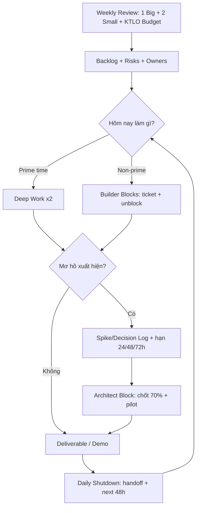

# Operating System Cá Nhân – Thắng Nguyễn (v1.1)

> Mục tiêu: **tốc độ bền vững** = *quyết sớm – chạy nhanh – không đốt pin – không làm SPOF (single point of failure).*  
> Bản v1.1 là “bản vá” sau khi bạn phản hồi về: việc phức tạp kéo dài/khó đo, Zephyr là KTLO, và gánh nặng techlead thiết kế hệ thống.

---

## 0) Bản đồ vấn đề (đúng cái bạn đang gặp)

### Năng lực lõi
- Nhìn cục diện + đặt vấn đề + giao tiếp ⇒ tạo **khung** để người khác hiểu và chạy.
- Thiết kế hệ thống + lập kế hoạch dự án mạnh ⇒ thấy “đường đi nước bước”.
- Ước lượng nguồn lực / rủi ro tốt ⇒ ít ảo tưởng.
- Dùng người ổn ⇒ có nền để phân quyền.

### Cái giá phải trả
- Tham vọng + cơ hội ⇒ scope phình, kỳ vọng phình.
- Ôm đồm vì hệ thống phụ thuộc bạn ⇒ **SPOF**.
- Overthinking tầng mơ hồ ⇒ nghẽn quyết định ⇒ nghẽn thực thi.
- Chảy máu năng lượng vì phân tâm + nhiều role ⇒ bào mòn tinh thần.
- Motivation dao động ⇒ chạy tốt khi có cơ chế nhưng mới ~50–60%.

**Kết luận:** bạn thiếu không phải là năng lực, mà là **cơ chế chuyển hoá năng lực thành tốc độ bền vững**.

---

## 1) 5 Luật vận hành (đã đóng gói thành cơ chế)

### Luật 1 — Cadence cho việc mơ hồ (không chỉ “quyết định”)
Vấn đề quan trọng thường là **task phức tạp kéo dài, không đo được**.  
Giải pháp: chia thành 3 pha có **timebox** để không rơi vào “mơ hồ → trì hoãn”.

#### Pha A — Spike (Làm rõ)
- Timebox: **60–120 phút**
- Output bắt buộc (1 trang):
  - Bối cảnh / mục tiêu / ràng buộc
  - 2–3 hướng (options)
  - Rủi ro lớn
  - **Next 48h** (cần ai/dữ liệu/thử gì)

#### Pha B — Plan (Đủ để chạy)
- Timebox: **60–90 phút**
- Output:
  - WBS 5–10 dòng
  - milestone chính
  - DoD thô (DoD-0/1)
  - owner sơ bộ

#### Pha C — Execute (Đẩy vòng lặp)
- Thực thi theo ticket/owner
- Bạn giữ: tiêu chuẩn + bottleneck + quyết định

> Nguyên tắc: **Hết timebox → chốt 70% + pilot**, không để mở vô hạn.

---

### Luật 2 — Scope Budget + KTLO (Zephyr là “Keep The Lights On”)
Một số việc (như Zephyr giờ hành chính) không phải Big Bet nhưng ăn nhiều thời gian ⇒ đó là **KTLO / Run-the-business**.

#### 2.1 One Big Bet + Two Small Bets (mỗi tuần)
- **1 Big Bet**: thứ làm đổi vị thế (outcome lớn)
- **2 Small Bets**: hỗ trợ/tăng tốc/học nhanh
- Mọi thứ khác: backlog hoặc ủy quyền

#### 2.2 Thêm bucket KTLO + Capacity Budget
KTLO **không cạnh tranh bằng mục tiêu**, mà cạnh tranh bằng **capacity**.  
→ Phải định ngân sách thời gian cố định:

Ví dụ (điều chỉnh theo thực tế):
- **60–70%**: Zephyr KTLO
- **20–30%**: Big Bet công việc chính (release/quality/milestone)
- **10%**: buffer/sự cố

**Hai điều kiện bắt buộc để KTLO không “ăn sạch não”:**
1) **Module Owners** (build/CI, feature, bugs/release…)
2) **Techlead Office Hours**: 2 khung cố định/ngày để unblock/ra quyết định  
   (ngoài khung đó: mọi thứ vào ticket/decision log)

---

### Luật 3 — 2 Mode/Day: Architect vs Builder (tách não)
Không trộn “tầng cao” và “tầng thấp” trong cùng thời điểm.

**Architect (60–90’):**  
- khung/rủi ro/ưu tiên/quyết định  
- output: 1–2 quyết định + kế hoạch đủ chạy

**Builder (2–4 block):**  
- đẩy ticket, unblock, demo, đóng vòng lặp  
- output: deliverable cụ thể

**Rule:** đang Builder mà thấy mơ hồ → ném vào Decision/Spike log → xử trong Architect block.

---

### Luật 4 — Anti-SPOF: bạn chỉ giữ 2 thứ (và DoD phải “tiến hoá”)
Bạn là techlead ⇒ phải thiết kế hệ thống, nhưng không được “đốt não” và trở thành SPOF.

#### 4.1 Bạn chỉ giữ
1) **Tiêu chuẩn / Definition of Done**  
2) **Bottleneck + rủi ro + ưu tiên + nguồn lực**

Còn lại giao cho owner/module owner.

#### 4.2 DoD 3 mức (để bạn không kiệt sức)
- **DoD-0 (15’ khi khởi động)**: mục tiêu, non-goals, boundary/interface, 1–2 test tối thiểu
- **DoD-1 (30–45’ sau Spike)**: happy path, top 3 risks + cách test, metrics/logs cần có
- **DoD-2 (trước release)**: edge cases, perf/robustness, CI checks

> DoD không cần hoàn hảo ngay từ đầu. DoD là thứ **tiến hoá**.

#### 4.3 Thiết kế thành “tài sản tái dùng”
- **RFC (1–2 trang)**: đề xuất kiến trúc (problem/constraints/acceptance/options)
- **ADR (5–10 dòng)**: ghi lại quyết định (decision + rationale)

#### 4.4 Delegation cho thiết kế (không gánh 100%)
- Bạn viết RFC khung + acceptance criteria
- Giao 2 người viết option A/B trong 48h
- Bạn chọn 70% + pilot

---

### Luật 5 — Energy Budget (năng lượng là tài sản, không phải cảm hứng)
Motivation dao động là bình thường. Cần **cơ chế bảo toàn pin**.

- Mỗi ngày chỉ có **2 block “Deep/High”**
- Phân tâm/ham muốn: **cho quota 20–30 phút/ngày** (đừng cố “triệt” bằng ý chí)
- Ngủ/nhịp/ăn/uống/phục hồi là **hạ tầng**, không đem ra trả nợ công việc.

---

## 2) 4 “sọt” để tránh lẫn lộn (quản lý hiệu suất vs thiết kế vs ý tưởng)
Bạn hay lẫn lộn giữa: quản lý hiệu suất, kỷ luật, thiết kế hệ thống, lên ý tưởng.

Tách thành 4 buckets:
1) **Execution** – tạo output  
2) **Management** – tiến độ/người/risk  
3) **System Design** – kiến trúc/cơ chế  
4) **Ideas** – ý tưởng lung tung  

**Cơ chế thực thi:**
- Mỗi ngày **1 Inbox duy nhất** (chỗ đổ mọi thứ vào)
- Mỗi ngày **1 lần xử Inbox** (ví dụ 21:30–22:00)
- Ý tưởng nảy ra trong lúc làm → ghi 1 dòng vào **Idea Parking Lot** (≤10s) → quay lại.

---

## 3) Cadence review: ngày/tuần/tháng/quý (nhẹ nhưng đủ lực)

### Daily Startup (10’)
- Deep #1 / Deep #2 hôm nay là gì?
- Việc nào tới hạn Spike/Decision?
- Hôm nay mình giữ gì (DoD + bottleneck), giao gì?

### Daily Shutdown (10’)
- Done/Not done (1 dòng)
- Unblock request cho owner
- Hẹn Architect block cho việc mơ hồ ngày mai

### Weekly Review (60’)
1) Chọn **1 Big + 2 Small**
2) Top 3 risks
3) DoD cho Big Bet (đo được)
4) Chia deliverable + gắn owner (anti-SPOF)
5) Decision list (các quyết định cần chốt)

### Monthly Review (45–60’, cực nhẹ)
- 3 wins / 3 lessons / 3 bottlenecks
- cập nhật Capacity Budget (KTLO chiếm bao nhiêu %)
- 1 theme tháng (ví dụ “Anti-SPOF”)

### Quarterly Review (90’, chỉ 3 việc)
1) Stop doing list (cắt)
2) Delegation ladder (đẩy ownership)
3) 1 big outcome quý (đo được)

> Lưu ý: đừng biến tháng/quý thành “dự án tối ưu năng suất”, sẽ quay lại overthinking.

---

## 4) Lịch block mẫu (chạy sáng + tập tối + ngủ 23:00–05:00)
Mẫu ngày thường (tùy lịch công ty):

- **05:00–06:00**: chạy/HIIT nhẹ + tắm
- **06:00–06:30**: ăn sáng (không điện thoại)
- **06:30–07:15**: **Architect block (45–60’)**: spike/decision/risk/priority
- **08:30–10:00**: **Deep Work #1** (Job 1)
- **10:15–11:30**: Builder (tickets/review/sync)
- **13:30–15:00**: **Deep Work #2** (Job 1)
- **15:15–17:00**: Builder + handoff (anti-SPOF)
- **18:30–19:30**: tập sức mạnh + nấu ăn
- **20:00–21:30**: Job 2 (Small Bet) hoặc UT practice (luân phiên)
- **21:30–22:00**: shutdown + xử Inbox + plan ngày mai
- **23:00**: ngủ

**Quy tắc vàng:** Deep #1/#2 là “đất thiêng” — không họp, không chat, không cứu hoả (trừ SEV thật).

---

## 5) Sơ đồ vận hành (tổng quan)

---

## 6) Checklist áp dụng ngay (trong 48 giờ)

### Trong 24 giờ
- Tạo 1 Inbox (Notion/TickTick đều được)
- Tạo 4 nhãn: Execution / Management / System / Ideas
- Tạo Idea Parking Lot
- Đặt 2 khung **Techlead Office Hours** cố định

### Trong 48 giờ
- Chốt Capacity Budget tuần cho Zephyr (KTLO %)
- Chỉ định tối thiểu 2–3 Module Owners
- Chuẩn hoá DoD-0 template
- Tạo RFC/ADR template (rất ngắn cũng được)

---

## 7) Template (copy/paste)

### 7.1 Spike (1 trang)
- Context:
- Goal:
- Constraints:
- Options (A/B/C):
- Top risks:
- Decision deadline:
- Next 48h (who/what):

### 7.2 DoD-0 (15’)
- Goal:
- Non-goals:
- Boundary/Interface:
- Minimum tests (1–2):
- Owner:

### 7.3 ADR (5–10 dòng)
- Decision:
- Date:
- Status:
- Context:
- Rationale:
- Consequences:

---

## 8) Kết luận: “Gia Cát Lượng làm trục – Lưu Bang làm phong cách” (đúng và đã thành cơ chế)
- **Gia Cát Lượng (Kim):** chuẩn hóa, cadence, phân quyền, checklist, đo lường  
- **Lưu Bang (Thủy):** non-attachment, quyết sớm, buông đúng lúc, giữ lực đường dài

Bản OS này biến hai thứ đó thành **hệ vận hành cụ thể** để bạn nâng từ 50–60% lên trạng thái **tự duy trì** mà không đốt tinh thần.
